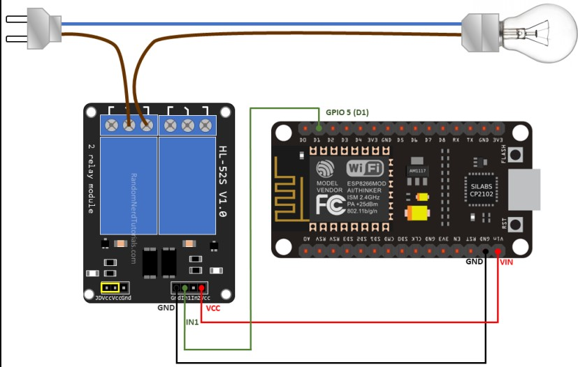

# Smart Lamp Controller

A complete IoT solution with Model Context Protocol to control a table lamp (or any other appliance) remotely using a NodeMCU, relay module, and MQTT communication through HiveMQ cloud service.

## Table of Contents

- [Overview](#overview)
- [Hardware Requirements](#hardware-requirements)
- [Software Components](#software-components)
- [Setup Instructions](#setup-instructions)
  - [Hardware Setup](#hardware-setup)
  - [HiveMQ Cloud Setup](#hivemq-cloud-setup)
  - [NodeMCU Setup](#nodemcu-setup)
  - [Server Setup](#server-setup)
  - [Proxy Setup](#proxy-setup)
- [Usage](#usage)
- [Project Structure](#project-structure)
- [Troubleshooting](#troubleshooting)
- [License](#license)

## Overview

This project allows you to control a table lamp (or any other electrical appliance) remotely using a NodeMCU microcontroller connected to a relay module. The system uses MQTT protocol via HiveMQ cloud service for secure and reliable communication.

The project consists of three main components:
1. **NodeMCU with Relay**: The hardware that physically controls your lamp
2. **MQTT Control Server**: A Python server with Model Context Protocol that manages the communication
3. **MCP Proxy**: A bridge between the client applications and the server

## Hardware Requirements

- **NodeMCU ESP8266**: WiFi-enabled microcontroller board
  - [Purchase link will be added here]
  
- **Relay Module**: Single channel relay (5V)
  - [Purchase link will be added here]
  
- **Jumper Wires**: For connecting components
  - [Purchase link will be added here]
  
- **Table Lamp**: Any standard lamp or appliance you want to control
  
- **Micro USB Cable**: For programming the NodeMCU

## Software Components

### 1. Hive.ino

Arduino sketch for the NodeMCU that:
- Connects to your WiFi network
- Establishes a secure connection to HiveMQ MQTT broker
- Subscribes to control commands
- Controls the relay based on received commands

### 2. mcp_server.py

Model Context Protocol (MCP) server that:
- Implements the MCP specification to expose function calling tools
- Creates an API for interacting with the MQTT broker
- Provides tool endpoints for turning the relay on/off or sending custom commands
- Makes these functions available to Claude Desktop via the proxy

### 3. proxy.py

JSON-RPC proxy that:
- Acts as a bridge between Claude Desktop and the MCP server
- Forwards tool commands from Claude to the server
- Returns responses back to Claude Desktop
- Enables Claude to control your lamp through natural language

## Setup Instructions

### Hardware Setup

#### Connecting NodeMCU to Relay Module



1. Connect the components as follows:

| NodeMCU Pin | Relay Module Pin |
|-------------|------------------|
| D1          | IN (Signal)      |
| 3V3         | VCC              |
| GND         | GND              |

2. Connect your lamp to the relay:
   - Identify the power cable for your lamp which typically has two wires (live/hot and neutral)
   - Cut the live/hot wire (usually brown, red, or black depending on your region)
   - Connect one cut end to the "Common" (COM) terminal on the relay
   - Connect the other cut end to the "Normally Open" (NO) terminal on the relay
   - Leave the neutral wire (usually blue or white) intact and connected directly to your lamp
   - When the relay is activated, it will complete the circuit allowing current to flow to the lamp

Wiring diagram:
```
Power Source (Live) → Relay (COM) → Relay (NO) → Lamp
Power Source (Neutral) → Lamp
```

⚠️ **SAFETY WARNING**: Working with mains electricity is dangerous and can be fatal. If you're not comfortable with electrical wiring, please seek professional assistance. Always work with the power disconnected and consider using lower voltage options like USB-powered lamps for safety.

### HiveMQ Cloud Setup

1. Visit [HiveMQ Cloud](https://www.hivemq.com/) and create a free account
2. Create a new cluster:
   - Click "Create Cluster"
   - Choose the free plan
   - Select a region closest to you
   - Give your cluster a name
3. Create credentials:
   - Go to "Access Management"
   - Click "Add New Credentials"
   - Note your username and password
4. Note your broker URL (will look like: xxxxxxxx.s1.eu.hivemq.cloud)

### NodeMCU Setup

1. Install the Arduino IDE from [arduino.cc](https://www.arduino.cc/en/software)
2. Add ESP8266 board support:
   - Open Arduino IDE
   - Go to File > Preferences
   - Add `http://arduino.esp8266.com/stable/package_esp8266com_index.json` to Additional Board Manager URLs
   - Go to Tools > Board > Boards Manager
   - Search for ESP8266 and install
3. Install required libraries:
   - Go to Sketch > Include Library > Manage Libraries
   - Install "PubSubClient" by Nick O'Leary
   - Install "ESP8266WiFi"
4. Open the `Hive.ino` file
5. Update the following variables with your information:
   ```cpp
   const char* ssid = "YOUR_WIFI_SSID";
   const char* password = "YOUR_WIFI_PASSWORD";
   const char* mqtt_server = "YOUR_HIVEMQ_URL"; 
   const char* mqtt_username = "YOUR_HIVEMQ_USERNAME";
   const char* mqtt_password = "YOUR_HIVEMQ_PASSWORD";
   ```
6. Connect your NodeMCU to your computer via USB
7. Select the correct board and port from Tools menu
8. Click Upload button to flash the code

### Server Setup

1. Make sure you have Python 3.7+ installed
2. Install required libraries:
   ```bash
   pip install paho-mqtt fastapi uvicorn sse-starlette asyncio pydantic
   ```
3. Open `mcp_server.py`
4. Update the MQTTControlTool class with your HiveMQ credentials:
   ```python
   self.broker_address = "YOUR_HIVEMQ_URL"
   self.broker_port = 8883
   self.username = "YOUR_HIVEMQ_USERNAME"
   self.password = "YOUR_HIVEMQ_PASSWORD"
   ```
5. Start the server:
   ```bash
   python mcp_server.py
   ```
   This will start the server on port 8000

### Proxy and Claude Desktop Setup

The proxy will be managed by Claude Desktop and does not need to be run separately:

1. Ensure the server is running (mcp_server.py)
2. Configure Claude Desktop to use the proxy:
   - Open Claude Desktop
   - Create or edit your Claude Desktop configuration file (`claude_desktop_config.json`)
   - Add the following configuration:
     ```json
     {
       "mcpServers": {
         "tablelamp_proxy": {
           "command": "python",
           "args": ["path/to/your/proxy.py"]
         }
       }
     }
     ```
   - Replace `path/to/your/proxy.py` with the actual file path to your proxy.py
3. Restart Claude Desktop to load the new configuration
4. When Claude Desktop starts, it will automatically launch the proxy which connects to your server

With this setup, you can directly ask Claude in natural language to control your lamp, for example: "Turn on my table lamp" or "Turn off the light".

## Usage

Once everything is set up and running:

1. The NodeMCU will connect to your WiFi network and the MQTT broker
2. The server provides endpoints to control the relay:
   - `/mcp/call_tool` endpoint accepts POST requests to turn the relay on/off
3. You can control the lamp by:
   - Sending "ON" command to turn on the lamp
   - Sending "OFF" command to turn off the lamp

### Example Commands

Through the proxy (which will be used by clients):
```json
{"jsonrpc": "2.0", "method": "tools/call", "params": {"name": "turn_on"}, "id": 1}
```

```json
{"jsonrpc": "2.0", "method": "tools/call", "params": {"name": "turn_off"}, "id": 2}
```

Direct API calls to the server:
```bash
curl -X POST http://localhost:8000/mcp/call_tool -H "Content-Type: application/json" -d '{"name": "turn_on"}'
```

```bash
curl -X POST http://localhost:8000/mcp/call_tool -H "Content-Type: application/json" -d '{"name": "turn_off"}'
```


## Troubleshooting

### NodeMCU Not Connecting

- Verify your WiFi credentials
- Check if your WiFi router uses 2.4GHz (ESP8266 doesn't support 5GHz)
- Ensure the NodeMCU is within range of your WiFi router

### MQTT Connection Issues

- Verify your HiveMQ credentials
- Check your broker URL is correct
- Ensure your HiveMQ plan is active

### Relay Not Switching

- Check the wiring between NodeMCU and relay
- Verify the relay is receiving power (indicator LED should be on)
- Test the relay with a simple test sketch

## License

This project is licensed under the MIT License - see the LICENSE file for details.
